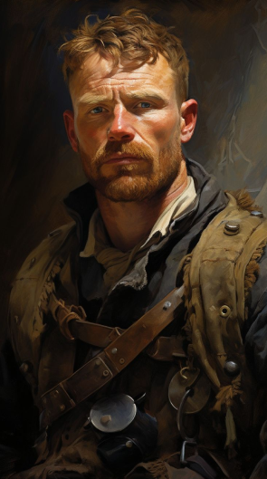

    

        
    

    

        <strong><em>"Состояние: Вернулся после отсутствия"</em></strong>  
    

    

        Располагается в доках, в районе Истэнда.
        Известно местоположение офиса, но не его личного жилья. 
        Занимается перевозкой и арендой складов. Имеет свою личную банду.
         
        Работал с “Рыцарями Динамитчиками” предоставляя им склад в аренду, где хранился динамит. 
        Склад взорван. Все еще имеет с ними контакты. 
        Крайне недоволен потерей склада, требует от Алана как то заработать.
    

> [!question] Информация требующая проверки:
> Подозревался в отравлении кровавых бочек.
> 
> Замешан в сговоре с Манчестерским князем.
> 
> Является чайлдом Смеющегося Джека.
> 
> Имеется свой человек среди Носферату.